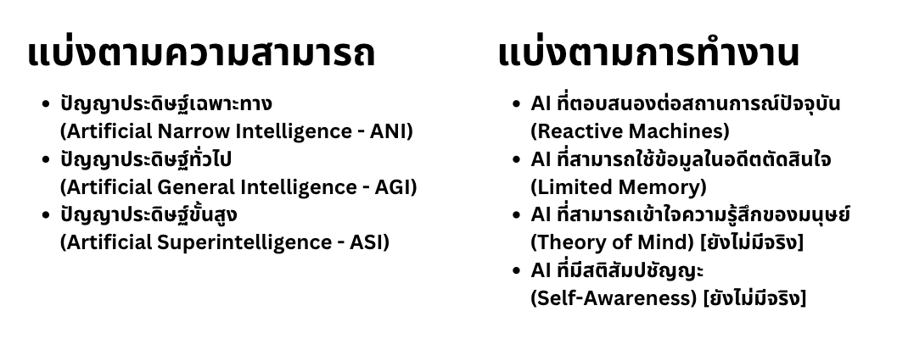
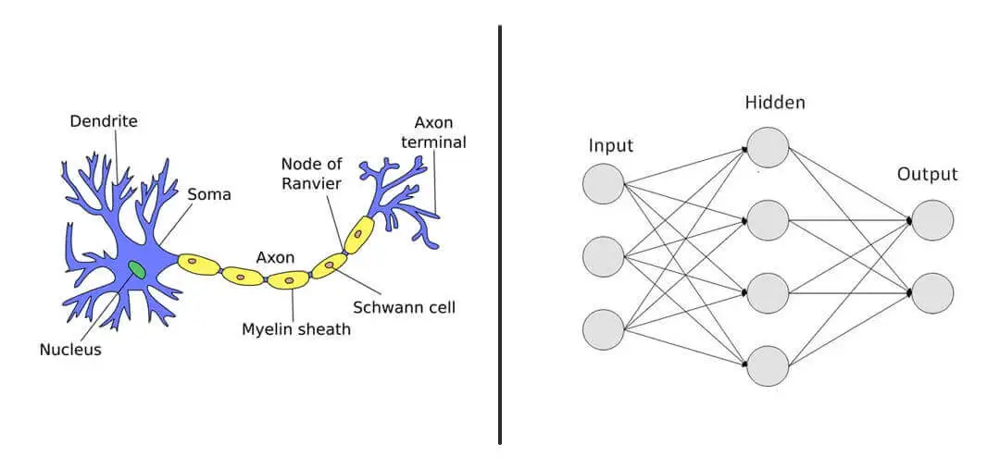
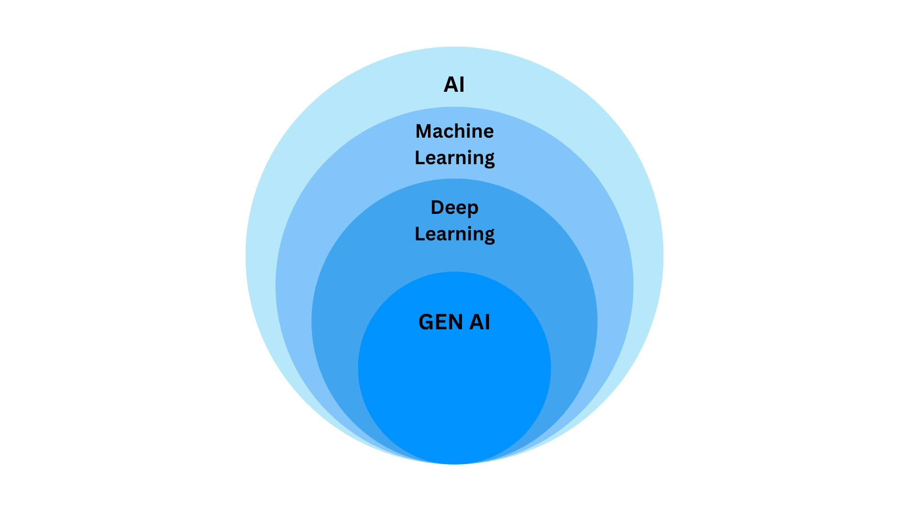
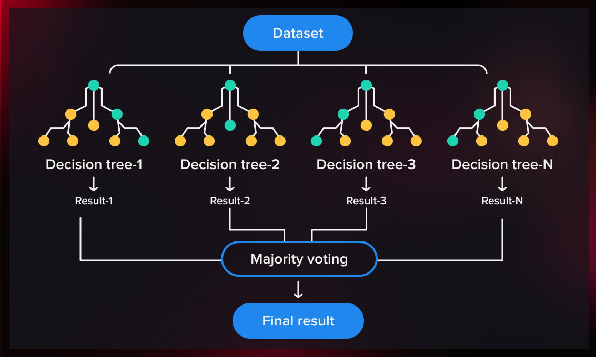

## What is AI?

**Artificial Intelligence (AI)** is a branch of computer science that focuses on creating systems or machines capable of performing tasks that typically require human intelligence, such as learning, reasoning, problem-solving, and understanding language.

AI is widely used in daily life, such as search engines, translation tools, and smart home systems. In the past, AI started by mimicking human physical abilities, such as computer vision.

AI has evolved through different eras with the goal of achieving capabilities close to or even surpassing human intelligence, such as decision-making in specific tasks or object recognition.

## Types of AI

AI can be categorized in two ways:

### Categorization by Capability

- **Artificial Narrow Intelligence (ANI)**: AI designed for specific tasks, such as recommendation systems or voice assistants like Siri and Alexa.
- **Artificial General Intelligence (AGI)**: AI with human-like intelligence that can learn and understand across multiple domains. Currently, it is still in research and development.
- **Artificial Superintelligence (ASI)**: AI that surpasses human intelligence in all aspects. This is still a theoretical concept and has not been developed yet.

### Categorization by Functionality

- **Reactive Machines**: AI that responds to current situations without memory, such as IBM's Deep Blue chess-playing system.
- **Limited Memory**: AI that can use past data to improve decision-making, such as self-driving cars that process sensor data.
- **Theory of Mind**: AI that can understand human emotions and thoughts. This is still in the research phase.
- **Self-Awareness**: AI that has consciousness and self-awareness like humans. This remains a theoretical concept.

## AI in the Present

Some types of AI are still in the research phase, while others are already in use. AI development is no longer a distant concept—individuals can build AI at home with the right knowledge and programming skills.

## Machine Learning (ML) and Deep Learning (DL)

Modern AI is mainly divided into two categories:

### Machine Learning (ML)

ML is a technique for developing systems that can learn from data and improve performance without explicit programming. ML algorithms analyze data, detect patterns, and make decisions, such as:

- Email spam filtering
- Product recommendations on online platforms
- Speech recognition

### Deep Learning (DL)

DL is a subset of ML that focuses on using multi-layered artificial neural networks to simulate the human brain. It is used for complex data processing, such as:

- Image recognition
- Natural language processing
- Autonomous driving

The main difference between ML and DL is that DL can automatically learn features from data without human-defined attributes.

## Training AI Models

Both ML and DL operate by training models with datasets. The model learns patterns and correlations within the data to make decisions when deployed in real-world applications.

## CustomAI: Our Platform

Our platform, **CustomAI**, enables users to create models for image detection and classification in both ML and DL categories without needing to write code. Users can also learn more about AI and develop their own AI solutions on our platform.
